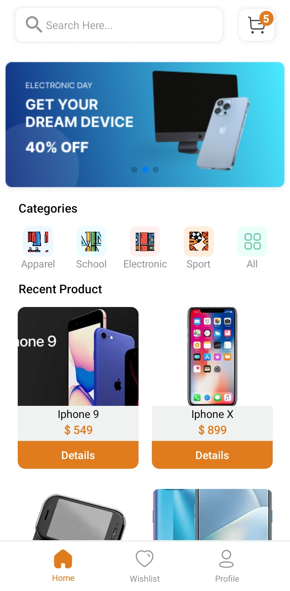
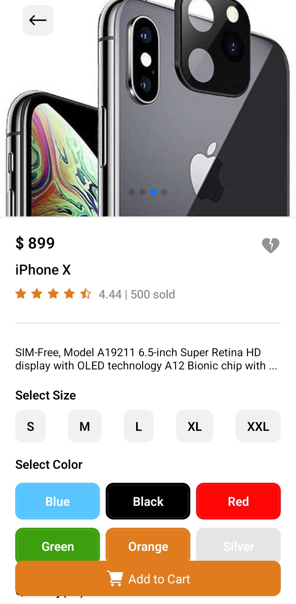
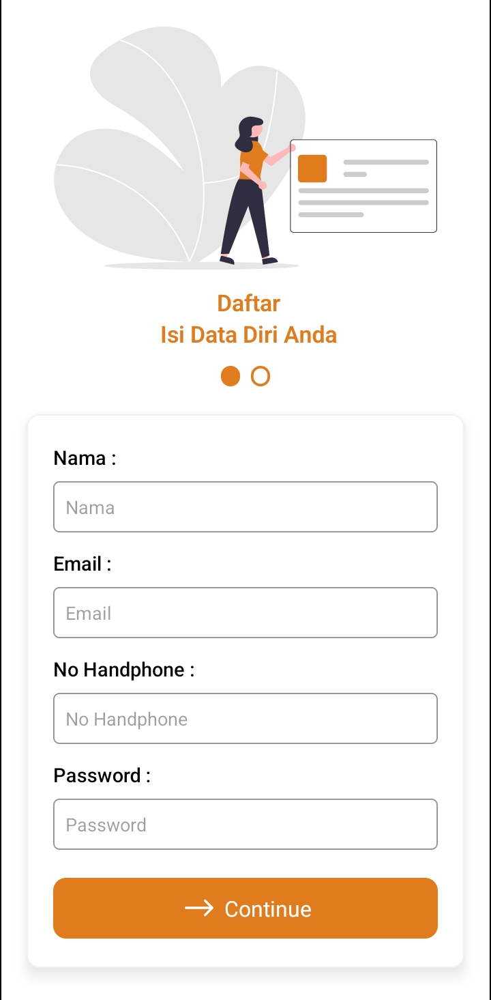
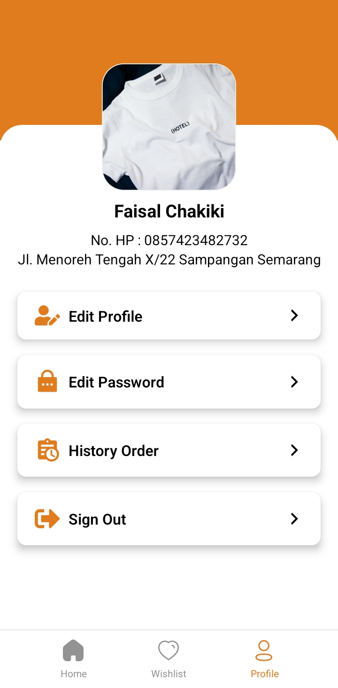
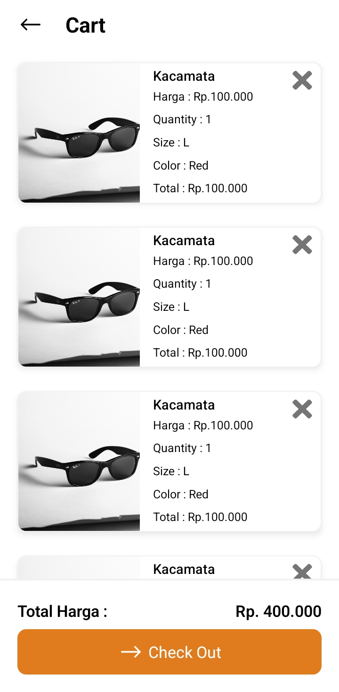
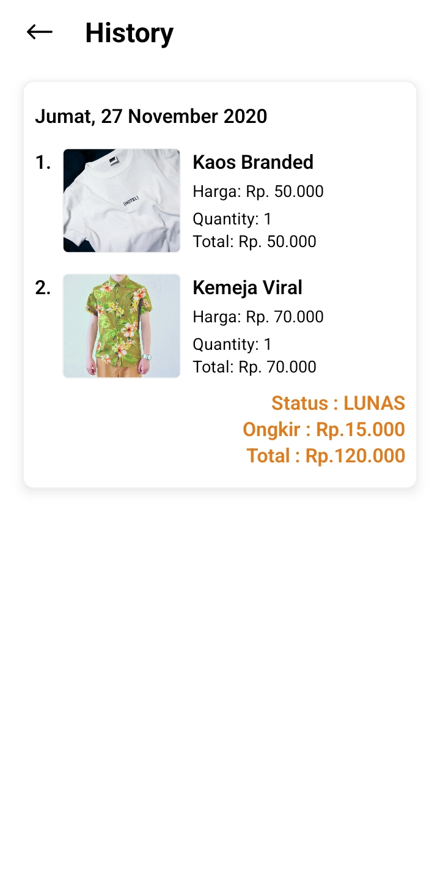
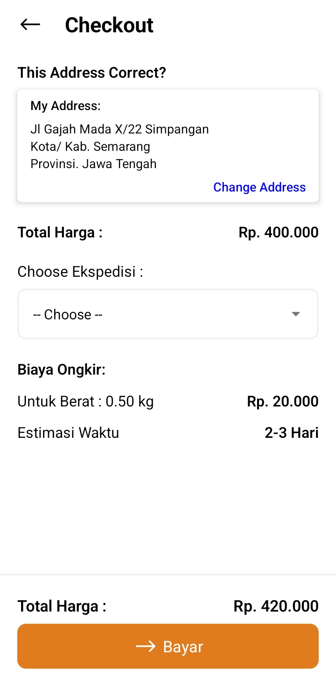

# Tak Tik Shop (rn-ecommerce)
## APK Ecommerce
### This is a task project I created with React Native (Expo). Because the database project is not finished yet, it still looks like the screenshot below.

### How to run this project
1. Clone this repo
2. Install Node Modules with `yarn install` / `npm install`
3. split terminal for running `npm run start` and `npm run android`
4. Install Expo at Android or IOS
5. Scan Barcode at terminal

### Preview App
| Home Menu  | Detail Product |
| ------------- | ------------- |
|   |  |

| Login Screen | Register Screen | Profile Menu |
| ------------- | ------------- | ------------- |
|   |   |   |

| Cart Screen | History Screen | Checkout Screen |
| ------------- | ------------- | ------------- |
|   |   |   |
